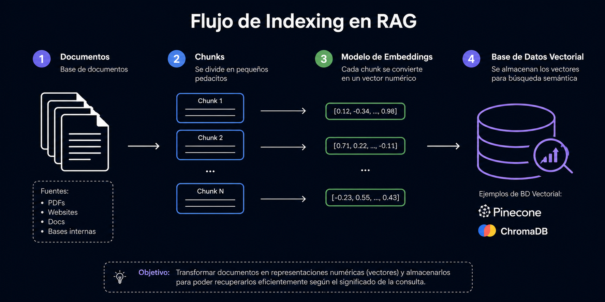
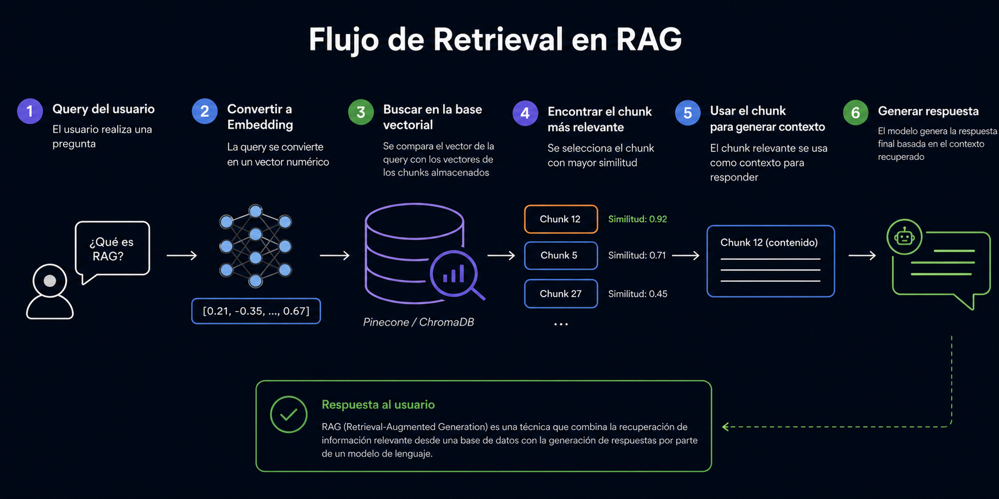

# RAG (Retrieval Augmented Generation)

## ¿Qué es RAG?

Imagina que le pides a un amigo muy inteligente que responda una pregunta, pero antes le entregas un libro abierto en la página exacta donde está la respuesta. Eso es RAG.

**RAG** es una técnica que combina un **LLM (Large Model Language)** con una fuente externa de información (documentos, PDFs, bases de datos, etc.). En lugar de responder solo con lo que "recuerda" de su entrenamiento, el modelo primero **busca información relevante** y luego la usa como **contexto** para generar su respuesta.

## ¿Por qué existe RAG? (El problema que resuelve)

Los LLMs tienen tres limitaciones importantes:

1. **Conocimiento congelado**: el modelo fue entrenado hasta una fecha específica, así que no sabe nada de lo que pasó después.
2. **Alucinaciones**: si le pides información muy específica o que no conoce bien, puede "inventar" respuestas que suenan creíbles pero son falsas.
3. **Sin acceso a datos privados**: el modelo nunca vio los documentos internos de tu empresa, tus manuales, tus bases de datos, etc.
4. **Problema de contexto**: Acumulamos todo en una variable y ocupamos token de forma incesaria.

> **La solución: RAG**
> - Permite responder usando documentos propios de la organización.
> - Reduce las alucinaciones, porque el modelo se apoya en información real y verificable.

## Las 3 partes de RAG (explicadas simple)

Piensa en RAG como un proceso de 3 pasos, igual que cuando haces una tarea con un libro de consulta:

### 🔎 1. Retrieval (Recuperación)
*"Busco en mis libros la página que necesito"*

El sistema busca información relevante en documentos, PDFs, bases de conocimiento o bases de datos vectoriales. Es como usar el buscador (Ctrl+F) pero mucho más inteligente: encuentra los fragmentos de texto más relacionados con la pregunta.

### ➕ 2. Augmentation (Aumentación)
*"Pego esa página junto a mi pregunta"*

La información recuperada se **agrega al contexto** que recibe el LLM. Ahora el modelo no solo tiene tu pregunta, sino también los fragmentos de texto relevantes que encontró en el paso anterior.

### 🤖 3. Generation (Generación)
*"Leo la página y respondo con mis propias palabras"*

El LLM combina dos cosas para generar la respuesta final:
- Su conocimiento general (lo que aprendió durante el entrenamiento).
- El contexto recuperado (los fragmentos específicos que encontró).

## Flujo de RAG

### Retrieval

