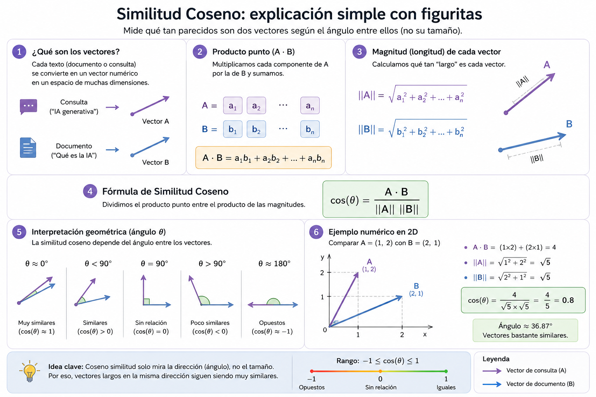

# Similitud Coseno

Es una metrica que mide la similitud entre dos vectores en un espacio multidimensional, calculando el coseno del ángulo entre ellos.

> Sirve para predecir la siguiente palabra en un modelo de lenguaje o sugerir un contexto similar, ayuda a tecnologías de motores de recomendación ya que LLM utiliza similitud coseno para entender la relación semántica entre palabras.

$$\text{Similitud Coseno}(\mathbf{A}, \mathbf{B}) = \cos(\theta) = \frac{\mathbf{A} \cdot \mathbf{B}}{\|\mathbf{A}\| \|\mathbf{B}\|} = \frac{\sum_{i=1}^{n} A_i B_i}{\sqrt{\sum_{i=1}^{n} A_i^2} \sqrt{\sum_{i=1}^{n} B_i^2}}$$

## Significado de cada componente

- a . b = producto punto de los vectores
- ||a|| y ||b|| = magnitud del vector a y b
- cos(θ) = coseno del ángulo entre ambos vectores
  - si es 1, los vectores son iguales
  - si es 0, los vectores son ortogonales (perpendiculares no tienen relación de dependencia)
  - si es -1, los vectores son opuestos

